# :closed_book: Documentation d’architecture

## A - Schéma de l'architecture et détails du réseau

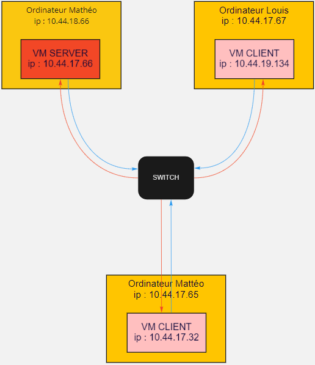

Notre **architecture** est composée de :
un switch (+ câbles RJ45)
3 PC
2 VM Windows 10 (client)
1 VM Windows Server (serveur)

Les PC sont reliés au **switch** avec les câbles RJ45, on crée donc un réseau privé. Chaque PC et chaque VM ont une **adresse IPv4 différentes**.

**Configuration** du **réseau** (IP) :

- adresse de sous-réseau : 10.44.16.0
- plage d’adresses : 10.44.16.1 - 10.44.19.254
- adresse de broadcast : 10.44.19.255
- masque de sous-réseau : 255.255.252.0 (/22)

## B - Mise en œuvre des bonnes pratiques

Pour déployer un serveur, il faut suivre certaines règles de bonnes pratiques :

### 1. La sécurité :
Il est important qu'un réseau soit sécurisé, pour éviter que l'on puisse notamment accéder aux ordinateurs qui composent ce réseau. C'est pour cela qu'il est important d'appliquer quelques solutions de sécurités comme par exemple : 

  - appliquer des mots de passe
  - des pare-feu
  - des antivirus
  - un protocole DHCP, pour éviter les problèmes et/ou failles potentielles 

### 2. L'installation :

La configuration de la VM Windows Server est importante :
   - Alloué 2Go de mémoire au minimum (plus si possible)
   - Suivre les paramètres recommandés pour l'espace disque (taille, allocation, etc...)

### 3. La nomenclature :
Autre point important de bonne pratique, avoir une nomenclature correcte et précise, comme par exemple mettre un U au devant des GPO utilisateurs, pour spécifier qu'elles s'appliquent aux utilisateurs. Et tout simplement, d'avoir des noms indicatifs de l'utilité des GPO, groupes, ou utilisateurs.

## C - **Configuration** pour avoir un serveur utilisant un Annuaire et une GPO

### 0. A - **Installation** de Windows Server

Nous ne pouvons pas vous montrer l'installation d'une machine avec Windows Server. 

Il suffit juste de récupérer un ISO d'une version *Windows Server*. (Dans le cas où vous avez une licence Microsoft adapté) Vous pouvez trouver un ISO [ici](https://portal.azure.com/?Microsoft_Azure_Education_correlationId=622a7312-a981-4b4f-927c-a746d7804853#blade/Microsoft_Azure_Education/EducationMenuBlade/software)

Cliquez ensuite sur ***Generate URL***:

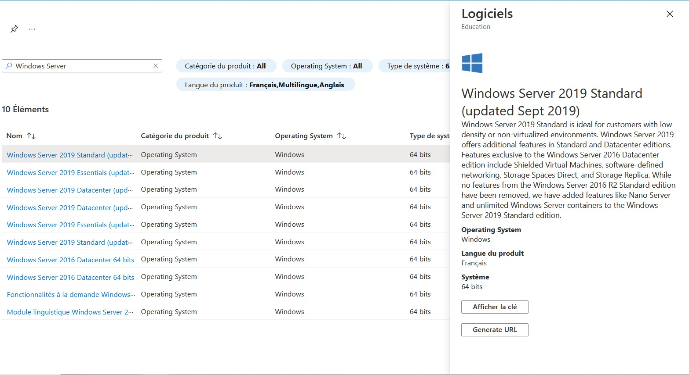

Une fois l'ISO téléchargé, dans notre cas, on installe une VM à partir de cet ISO.

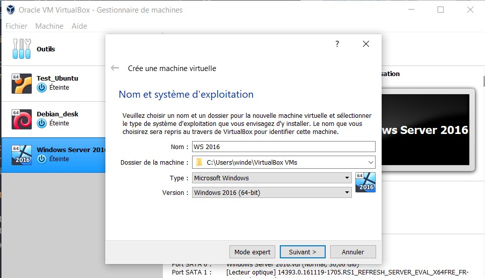
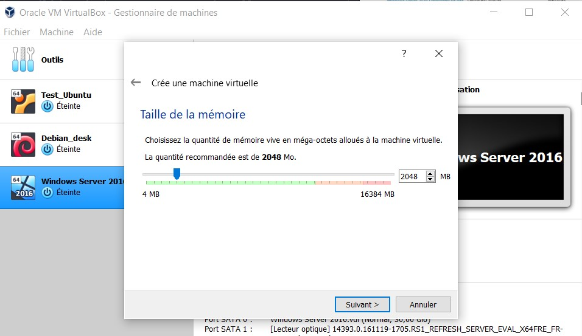
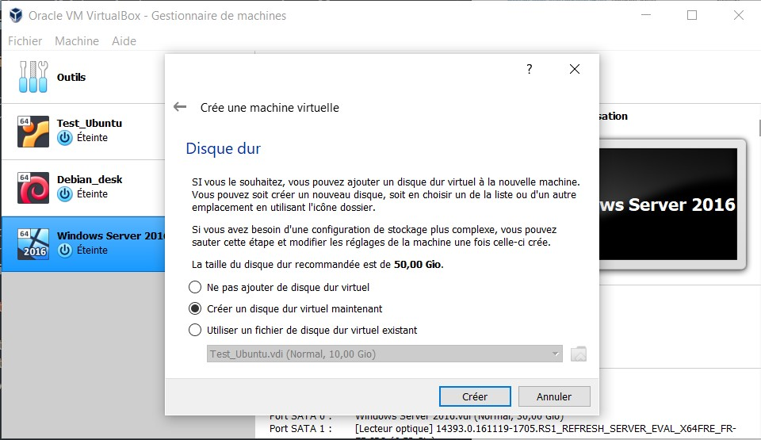

Une fois le disque dur créé, suivez les étapes jusqu'à arriver au moment où il faut choisir l'ISO.

Une fois l'installation fait, lancez la VM et suivez les étapes pour installer Windows Server.

### 0. B - Désactiver le par-feux : 
**Désactivation** des **pare-feu** (après ne plus avoir accès à Internet).
   1) Aller dans ***Paramètres réseau & Internet***

   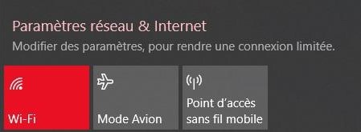

   2) Cliquer sur Pare-feu Windows

   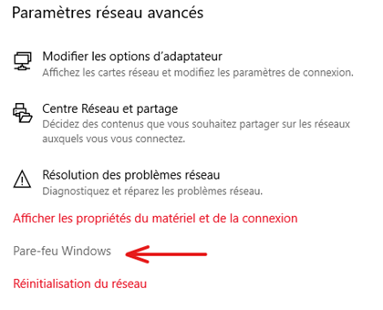

   3) Puis allez dans ***Réseau privé*** (ou ***Réseau public*** selon la configuration par défaut du réseau avec le switch)

   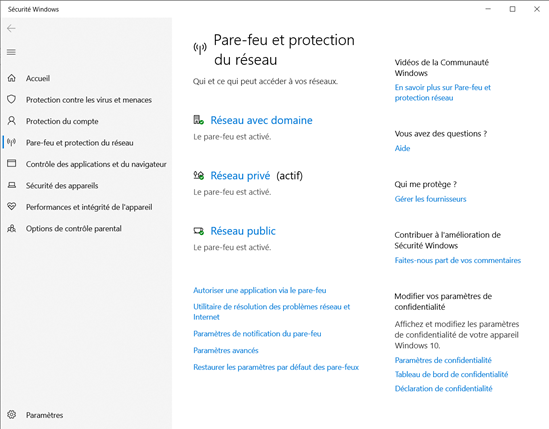

   4) Ensuite désactivez le pare-feu.

   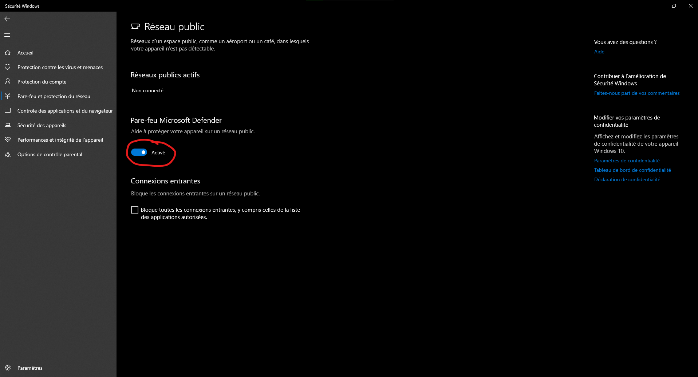

### 0. C - Désactivation du wifi :
Il peut etre important de désactiver le wifi pour éviter tout problème : 

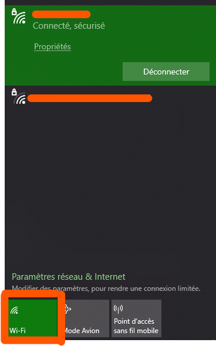

### 1. **Configuration** du serveur Windows

Une fois que le serveur est installé, il faut le configurer,

Pour cela, il faut cliquer sur ***Configurer ce serveur local***. Afin que le serveur soit bien configuré, quelques points sont importants à prendre en compte :

- Il faut donner un nom explicite à son serveur.
- Il faut lui attribuer une adresse IP fixe.
- Il faut activer le Windows Update ainsi que le Windows Defender pour des raisons évidentes de sécurité.
- Et enfin, il faut redémarrer le serveur pour que les modifications soient prises en compte.

### 2. **Création** d’un domaine Active Directory

Maintenant que le serveur est installé et configuré, il faut maintenant installer un Active Directory (ou AD) qui sert de système de gestion du domaine, et qui nous permettra de relier tous les utilisateurs, ainsi que de maîtriser leurs droits.

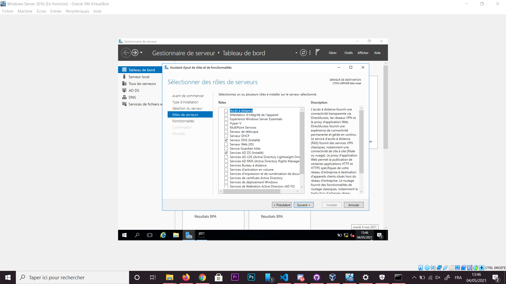
- Dans une session administrateur, on installe le "Services AD DS" dans "Installation basée sur un rôle ou une fonctionnalité"
- Puis on promouvoit le serveur en contrôleur de domaine
- On créé ensuite une nouvelle forêt, à laquelle on donne un nom de domaine racine, comme domaine.local ou nom-de-l-entreprise.local (et un nom de NetBIOS pour les anciennes versions)
- Et on valide l’emplacement (il est conseillé de laisser le chemin par défaut)
- Enfin, on redémarre la session, et l'Active Directory est installé.

### 3. **Création** des comptes utilisateurs du domaine
Il est important de créer des utilisateurs afin que les machines clientes puissent rejoindre le domaine.

Pour créer un utilisateur, il faut :

Tout d'abord, dans le **gestionnaire de serveur**, cliquez sur l'onglet **Outils** puis sur l'élément **Utilisateurs et ordinateurs Active Directory**.

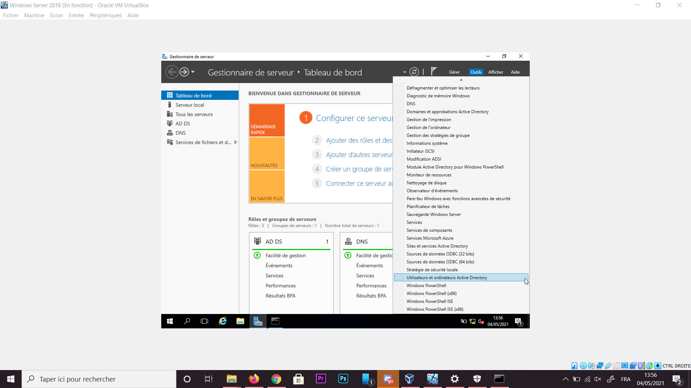

Une fois la fenêtre *Utilisateurs et ordinateurs Active Directory*, on peut créer un nouveau dossier qui sera notre **OU** (*Unité d’Organisation*) et qui aura nos utilisateurs de notre domaine (plus simple pour la gestion de créer notre propre *OU*). Pour ce faire, on clique droit sur le nom de notre domaine (*ltdm.local* dans notre cas) puis dans *Nouveau*, on créé une nouvelle *Unité d’Organisation* à laquelle on devra donner un nom, donc choisir un nom cohérent.

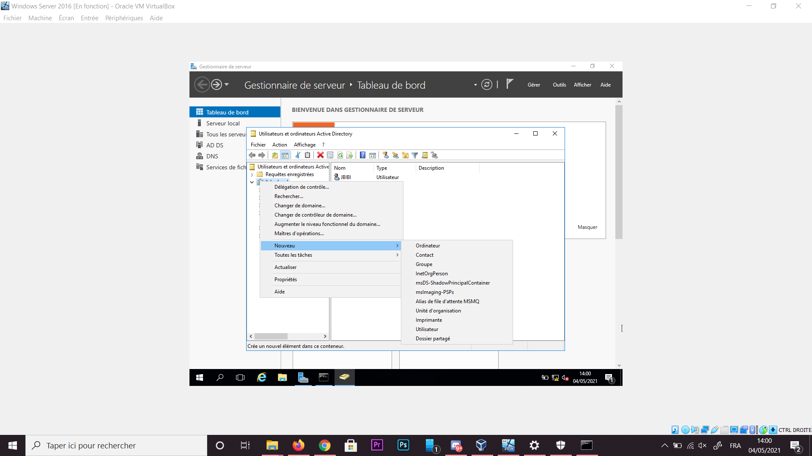

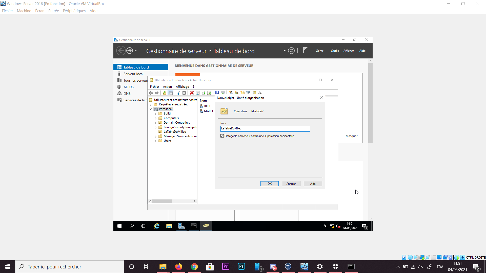

Clic droit sur la nouvelle *OU* et créé un **nouvelle Utilisateur** en faisant *Nouveau > Utilisateur*

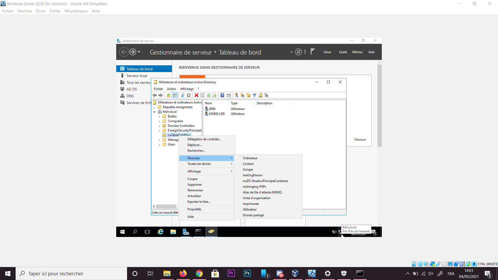

Vous pouvez donc donner un *nom*, *prénom*, mais aussi le *nom d'ouverture de session*. Il est plus intéressant de garder la même forme pour le *nom de session* afin de s'y retrouver facilement.

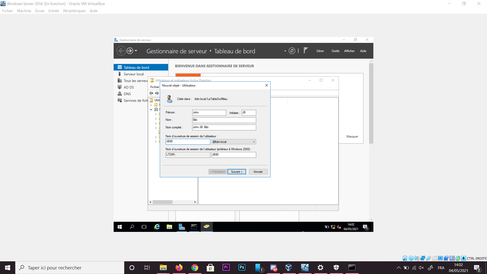

On choisi donc un mot de passe pour le compte, puis les règles qui lui sont appliqués comme : "Le mot de passe n'expire jamais".

4. **Création** d'un partage de fichier à l'aide d’une **GPO**

La solution pour partager des fichiers entre différents utilisateurs est de créer un mapage réseau avec une GPO.

- Tout d'abord, la permière étape consiste à partager sur le réseau un fichier local (ici on donne les droits à tout le monde)

- Modifier ensuite les options de sécurité du dossier (ici encore avec tout les droits, et pour "utilisateur", donc tout le monde)

- On active ensuite l'héritage 

- Puis on créé une nouvelle GPO nommé U_partage

- Auquel on ajoute un lecteur mappé (dans Modifier/Configuration utilisateur/Préférences/Paramètres Windows/Mappages de lecteurs.), auquel on configure un emplacement, une lettre (la dernière disponible) ... Et que l'on configure en Action "mise à jour"

- Une fois que tout ceci est fait, on peut appliquer cette GPO à un groupe spécifique.
Dans les propriétés du mappeur réseau, on fait un ciblage :

Dans lequel on chosis son groupe d'utilisateur (ici LTDM)

## D - Les configurations pour créer un espace centralisé de partage (les choses à faire avant de rejoindre le domaine)

Il y a plusieurs petites choses à faire afin d'avoir une communication possible entre les clients / serveur dans le sous-réseau.

### 1) **Configuration** manuel des **adresses IPv4** pour chaque **PC** et pour leur VM.
1) Parametres
2) Réseau et Internet
3) Centre réseau et partage
4) Cliquer comme sur l'image

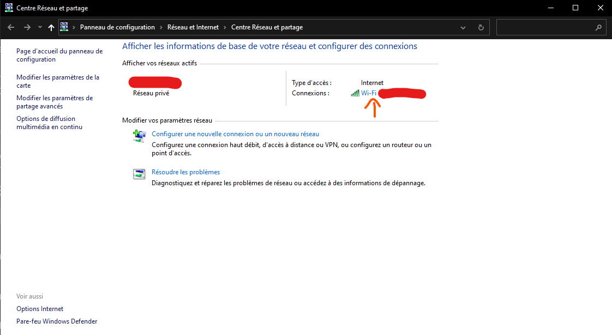

1) Propriétés
2) Chercher `Protocole internet version 4` et double cliquer dessus
3) Et ici vous pouvez attribuer une IP personnalisée

### 2) **Configuration** du **DNS**
1) Suivre les instructions comme ci-dessus
2) Mettre l’adresse IPv4 de la **machine serveur**.
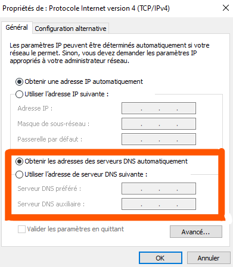

### 3) **Configuration** des **VM** (accès par ponts, etc…)
1) Dans virtual box choissisez la VM à parametrer
2) cliquer sur configurer

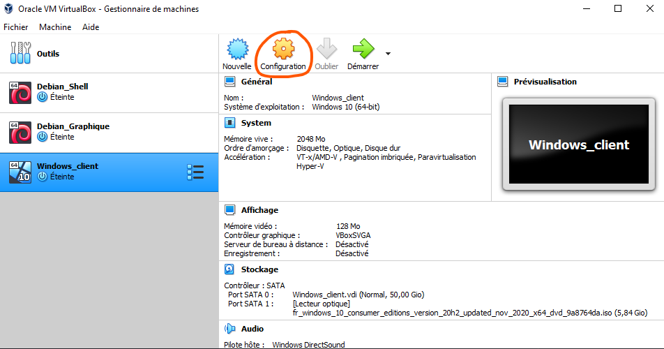

1) Allez dans l'onglet réseau
2) Dans la liste déroulante `Mode d'accès réseau` choisir `Accès par pont`

**Attention** : Il faut bien mettre le nom de son interface réseau correspondant.

    

