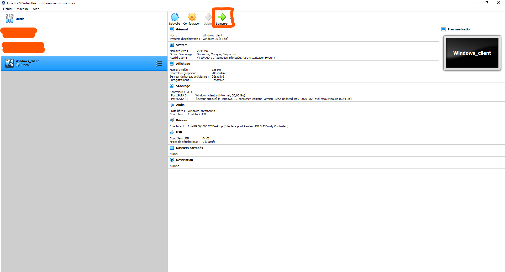
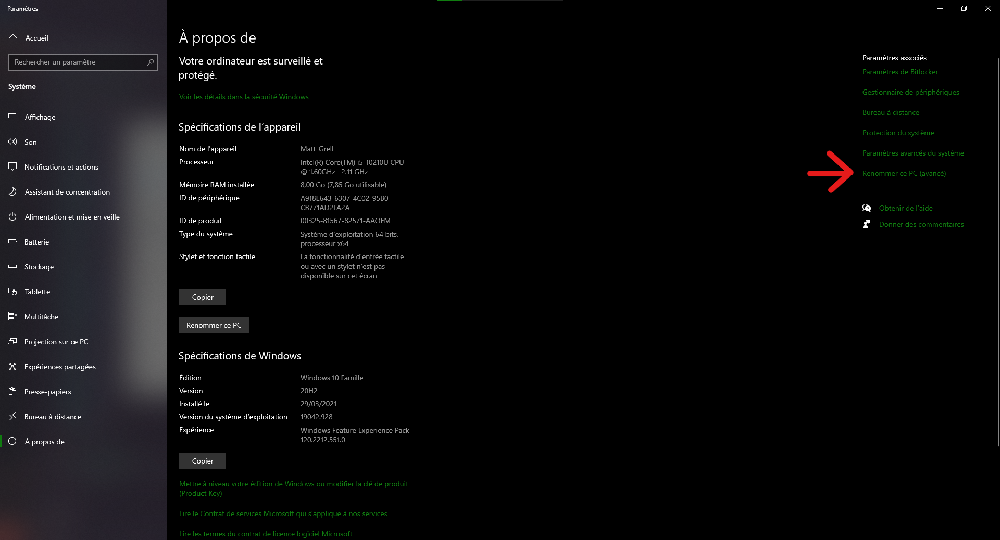

# :blue_book: Documentation d'exploitation

## A - Allumage des VMs

1) Ouvrir Virtual box
2) Cliquer sur ``Lancer``




## B - Connexion au domaine

    1) Cliquer sur le menu windows
    2) Ecrire renommer ce pc
    3) Cliquer sur ```afficher le nom de votre```
    4) Cliquer sur ``renommer ce pc`` 
    5) Sur l'onglet nom de l'ordinateur cliquer sur modifier
    6) Choisir membre d'un **domaine**
    7) Ecrire le nom de domaine créer par le serveur
   

## C - Application d'une GPO

   1) Aller dans ``Gestionnaire de serveur``
   2) Cliquer sur ``outils``
   
   3) Cliquer sur ``Utilisateurs et ordinateurs Active Directory``
   4) Cliquer droit sur objets de stratégies de groupes
   5) Donner un nom a la GPO et ``OK``
   6) Cliquer sur modifier
   Une fenetre `éditeur de gestion des stratégies de groupes`
   7) Aller sur ``configuration utilisateur`` **ensuite** ``stratégies`` **ensuite** ``Modèle d'administration : définition`` **ensuite** ``Système``
   8) choisir dans la liste ``Désactivez l'accès à l'invite de commandes``
   9) Activer cette sécurité en cliquant sur Activé ensuite ``OK``
   10) Cliquer sur ``dossier Personnel`` 
   11) Cliquer sur ``Lier un objet de stratégie de groupe existant``
   12) Choisir dans la première liste le premier domaine
   13) Choisir dans la deuxieme liste la GPO que vous avez créer en étape


