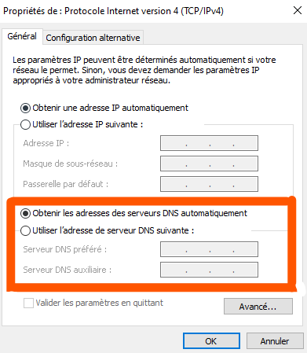

# :blue_book: Documentation d'exploitation

## A - Allumage des VMs

1) Ouvrir Virtual box
2) Cliquer sur ``Lancer``

1) **Configuration** manuel des **adresses IPv4** pour chaque **PC** et pour leur VM.
   1) Parametres
   2) Réseau et Internet
   3) Centre réseau et partage
   4) Cliquer comme sur l'image

   

   1) Propriétés
   2) Chercher `Protocole internet version 4` et double cliquer dessus
   3) Et ici vous pouvvez attribuer une ip personnaliser
2) **Configuration** du **DNS**.
    1) Suivre les instructions comme ci-dessus
    2) Mettre l'ipv4 de la vm serveur dans le dns comme ci_dessous :
    
3) **Configuration** des **VM** (accès par ponts, etc…)
    1) Dans virtual box choissisez la vm a parametrer
    2) cliquer sur configurer

   

    1) Allez dans l'onglet réseau
    2) Dans la liste déroulante `Mode d'accès réseau` choisir `Accès par pont`

## C - Application d'une GPO

   1) Aller dans ``Gestionnaire de serveur``
   2) Cliquer sur ``outils``
   .png)
   3) Cliquer sur ``Utilisateurs et ordinateurs Active Directory``
   4) Cliquer droit sur objets de stratégies de groupes
   5) Donner un nom a la GPO
   6) Cliquer sur modifier
   Une fenetre `éditeur de gestion des stratégies de groupes`
