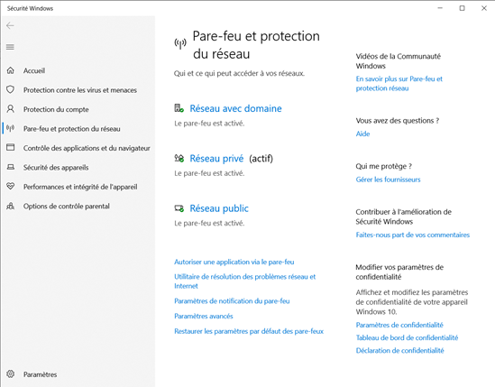
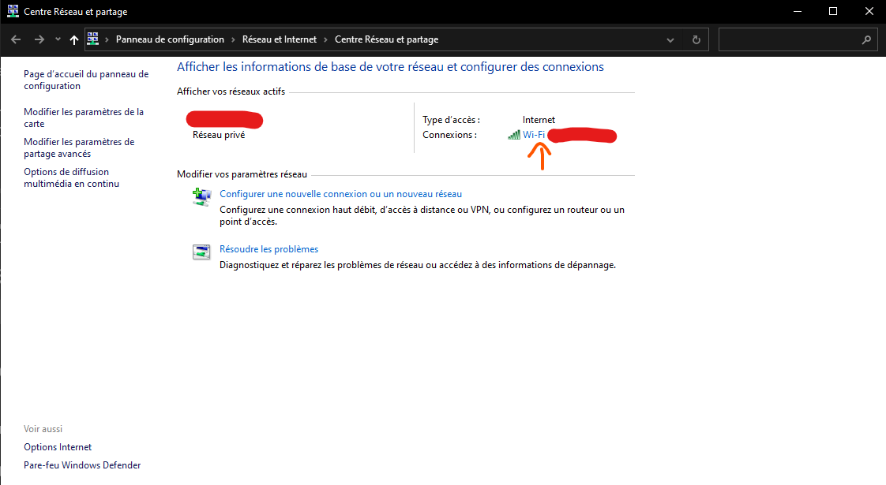

## B - Configuration minimale pour être dans le même réseau

1) **Désactivation** des **autres réseaux**

On désactive la connexion aux autres réseaux (comme la désactivation de la WIFI) disponible, afin d’éviter les malwares et les intrusions. En effet, dans le cadre de ce projet, nous n’avons pas mis en place de pare-feux personnalisés, par conséquent, il n’y a pas de sécurité.

2) **Désactivation** des **pare-feux** (après ne plus avoir accès à Internet).
   1) Aller dans ***Paramètres réseau & Internet***

   

   2) Cliquer sur Pare-feu Windows

   

   3) Puis allez dans ***Réseau privé*** (ou ***Réseau public*** selon la configuration par défaut du réseau avec le switch)

   

   4) Ensuite désactivez le pare-feu.

   

3) **Configuration** manuel des **adresses IPv4** pour chaque **PC** et pour leur VM.
   1) Parametres
   2) Réseau et Internet
   3) Centre réseau et partage
   4) Cliquer comme sur l'image

   

   1) Propriétés
   2) Chercher `Protocole internet version 4` et double cliquer dessus
   3) Et ici vous pouvvez attribuer une ip personnaliser
4) **Configuration** du **DNS**, mettre l’adresse IPv4 de la **machine serveur**.
    1) Suivre les instructions comme ci-dessus
5) **Configuration** des **VM** (accès par ponts, etc…)
    1) Dans virtual box choissisez la vm a parametrer
    2) cliquer sur configurer

   

    1) Allez dans l'onglet réseau
    2) Dans la liste déroulante `Mode d'accès réseau` choisir `Accès par pont`
